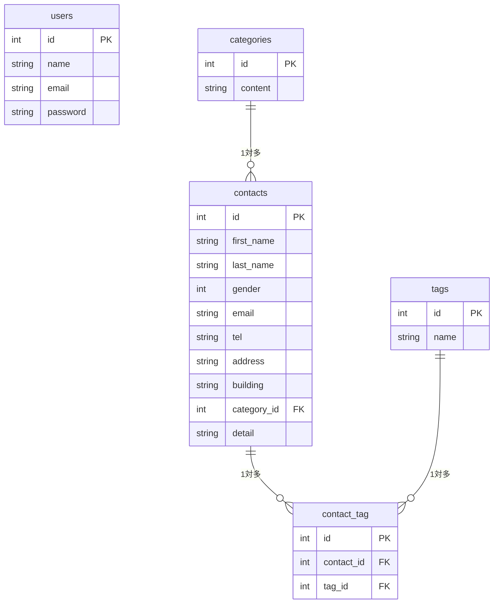

# COACHTECH お問い合わせフォーム

## 概要

本プロジェクトは、COACHTECH 課題として作成した「お問い合わせフォーム」アプリケーションです。  
ユーザーからのお問い合わせを受け付け、管理者画面で確認・検索・詳細閲覧ができる機能を実装しています。

## ER図

##　環境構築手順

1．レポジトリをクローン
git clone <git@github.com:Denchan55/contact-form-app.git>
cd <new-contact-form/contact-form-app>

2．Docker（Laravel Sail）を起動
cp .env.example .env
./vendor/bin/sail up -d

3.依存関係のインストール
./vendor/bin/sail composer install
./vendor/bin/sail npm install
./vendor/bin/sail npm run dev

4.アプリケーションキーの作成
./vendor/bin/sail artisan key:generate

5.マイグレーション&シーディング
./vendor/bin/sail artisan migrate --seed

##　使用技術
Laravel 10
PHP 8.2
MySQL 8.0
Docker / Laravel Sail
Tailwind CSS
Vite

## APIエンドポイント一覧

### ユーザー側（お問い合わせフォーム）

| メソッド | パス     | 概要                   |
| -------- | -------- | ---------------------- |
| GET      | /        | 入力フォーム表示       |
| POST     | /confirm | 入力内容の確認         |
| POST     | /back    | 入力画面に戻る         |
| POST     | /store   | お問い合わせ内容の保存 |
| GET      | /thanks  | 送信完了画面           |

### 管理者側（Admin）

| メソッド | パス          | 概要                                |
| -------- | ------------- | ----------------------------------- |
| GET      | /admin/login  | ログイン画面                        |
| POST     | /admin/login  | ログイン処理                        |
| POST     | /admin/logout | ログアウト                          |
| GET      | /admin        | お問い合わせ一覧                    |
| GET      | /admin/search | 検索機能                            |
| GET      | /admin/{id}   | 詳細画面                            |
| GET      | /admin/export | CSVエクスポート（実装している場合） |

##　開発環境URL
http://localhost
http://localhost/admin/login

## 作成者

江草英樹
